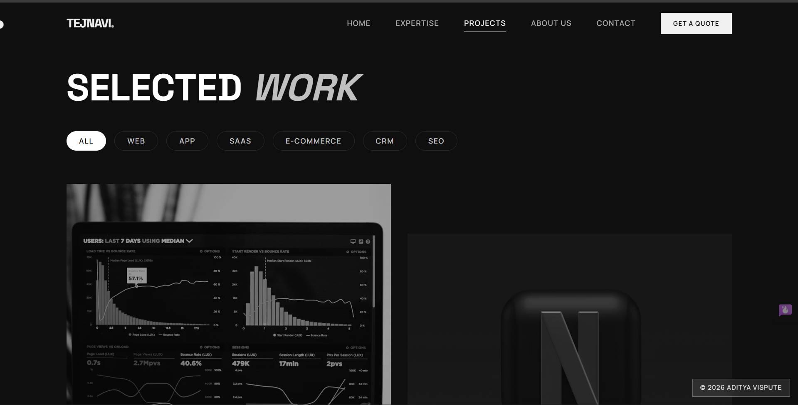
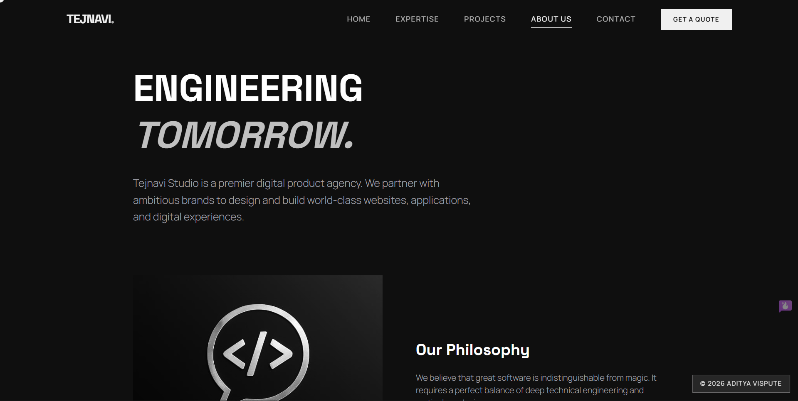
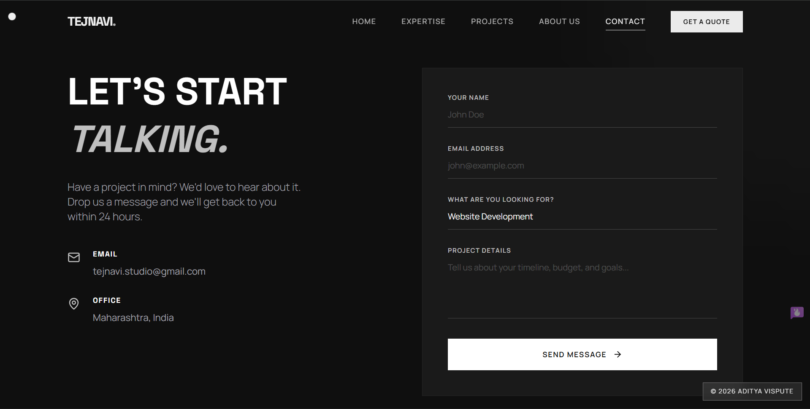
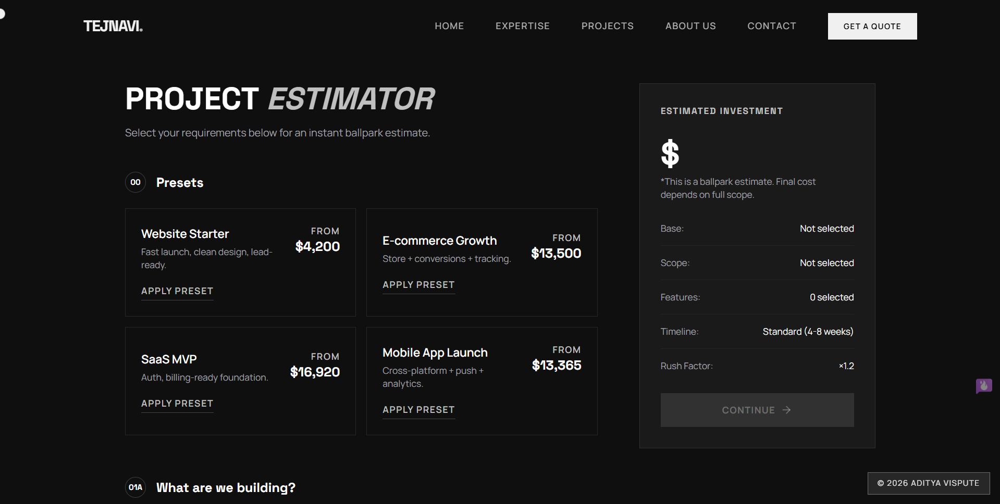

# Studio (Refined)

Premium dark-mode studio website built with a modern React + TypeScript stack.

## Overview

This repository contains the Tejnavi Studio website and supporting services.

- **Frontend**: `client/` (React + TypeScript + Vite)
- **Backend**: `server/` (Node.js server used by the project)
- **Shared types**: `shared/`

The UI follows a monochrome / metallic theme and includes smooth motion and micro-interactions.

## Key Features

- **Pages**
  - Home
  - Services / Expertise
  - Workflows (supports route `workflows/:slug`)
  - Quote / Project Estimator (presets + selections + estimate breakdown)
  - About, Contact, Projects

- **Workflows**
  - Single-workflow view based on URL slug
  - Vertical timeline/stepper styling

- **Quote / Estimator**
  - Service type selection
  - Requirement scoping per service type
  - Feature add-ons
  - Timeline multipliers
  - Presets displayed as normal cards (grid)

- **Legal & Ownership**
  - Footer includes **Privacy Policy** and **Terms of Service** as animated modal popups
  - Contact email: `adityavispute29@gmail.com`
  - Site attribution: **Aditya Vispute**

## Tech Stack

- **React + TypeScript**
- **Vite**
- **Tailwind CSS**
- **Framer Motion** (animations)
- **Wouter** (routing)
- **@tanstack/react-query**
- **Lenis** (smooth scrolling)
- **Radix UI / shadcn/ui** (UI primitives)

## Project Structure (high level)

- `client/`
  - `src/pages/` — route pages
  - `src/components/` — shared UI + layout components (`Navbar`, `Footer`, etc.)
  - `src/data/` — data modules (ex: workflows)
- `server/` — backend code
- `shared/` — shared types/utilities

## Screenshots

Here are some screenshots of the Tejnavi Studio website:

### Home Page

### Projects Page

### About Page

### Contact Page

### Quotation Page

## Notes

- The global HTML metadata is in `client/index.html`.
- The global footer is in `client/src/components/layout/Footer.tsx`.

## Copyright

© 2026 Aditya Vispute. All rights reserved.
